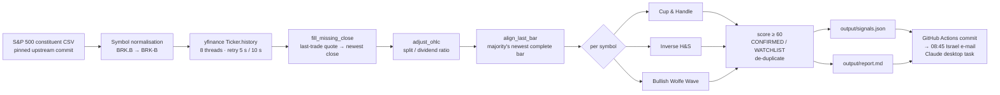

# SignalSync

[](https://github.com/yanivil/SignalSync/actions/workflows/tests.yml)
[](https://github.com/yanivil/SignalSync/actions/workflows/daily-scan.yml)
[](#)
[](LICENSE)
[](https://github.com/yanivil/SignalSync/discussions)

**SignalSync scans every S&P 500 constituent on daily bars for three bullish chart patterns and reports only confirmed, risk-defined setups with an entry, a structural stop and a reference target.**

It is a heuristic screener, not trading advice. Every hit should be checked on a chart before acting.

| Pattern | Type | Confirmation trigger | Stop-loss | Reference target |
|---|---|---|---|---|
| Cup & Handle | continuation | daily close above the handle high on ≥ 1.4× average volume | handle low − 0.25 ATR | entry + (right rim − cup bottom) |
| Inverse Head & Shoulders | reversal | daily close above the neckline on ≥ 1.3× average volume | right-shoulder low − 0.25 ATR | entry + (neckline at the head − head) |
| Bullish Wolfe Wave | reversal | daily close back above the 1-3 line after point 5 | point-5 low − 0.25 ATR | line 1-4 at the ETA |

Four rules shape every detector: **no forced patterns** (strict geometry plus a 0–100 quality score, minimum 60), **respect the wider trend** (SMA50/SMA200 filters), **enter only after confirmation** (close-based triggers with volume, `CONFIRMED` vs `WATCHLIST`, no chasing beyond 5 %), and **always define risk** (setups with a stop more than 12 % away for cups, 15 % for the others, are rejected). The rules follow the engine specification adopted on 2026-09-05; the previous rule set is kept as the `legacy` profile (`--profile legacy`) so the two can be replayed side by side.

## Pipeline



The whole scanner is one module, [`scan.py`](scan.py): constants at the top, then data loading, indicators, the three detectors, and reporting. See the wiki for the full walk-through.

## Quickstart

Requirements: Python 3.12, `pandas`, `numpy`, `yfinance`. [`requirements.txt`](requirements.txt) is hash-pinned (compiled from `requirements.in`); `requirements-dev.txt` adds pytest and ruff. No API keys: the constituent list comes from a pinned public GitHub dataset and prices from Yahoo Finance via yfinance.

```bash
python3 -m venv .venv && . .venv/bin/activate && pip install --require-hashes -r requirements.txt -r requirements-dev.txt
```

```bash
python scan.py                              # full S&P 500 scan, 2 years of daily bars
```

```bash
python scan.py --tickers AAPL,MSFT,NVDA -v  # subset, debug logging
```

```bash
python scan.py --min-score 70 --max-age 2 --csv my_universe.csv --out-dir out
```

```bash
python -m pytest -q                         # whole test suite, offline, about two seconds
```

`bash run_daily.sh` wraps the scan in a self-healing virtualenv and keeps dated logs under `logs/`.

| Flag | Default | Meaning |
|---|---|---|
| `--tickers` | S&P 500 | comma-separated symbols instead of the index |
| `--csv` | pinned GitHub CSV | local constituents file with a `Symbol` column |
| `--period` | `2y` | yfinance history period (about 500 daily bars) |
| `--min-score` | `60` | minimum quality score to report |
| `--max-age` | `3` | max bars since the confirming close (H&S and Wolfe get +5 for pivot lag) |
| `--profile` | `spec` | rule profile: `spec` (the specification), `tuned` (spec with four rules relaxed on replay evidence; what the nightly job runs) or `legacy` (rules until 2026-09-05). See the tuning page for the replay comparison. |
| `--out-dir` | `output` | where `signals.json` and `report.md` are written |

Exit codes: `0` ok, `2` no price data at all (network problem).

## Sample output

`output/report.md` from the 2026-09-04 run (abridged):

```
# S&P 500 pattern scan — 2026-09-04 08:25

Scanned 502 of 503 symbols (daily bars, last bar 2026-09-03). Min quality score 60.
Breakouts older than the per-pattern limit are dropped (bars: Cup & Handle 3,
Inverse Head & Shoulders 8, Bullish Wolfe Wave 8; ...).
Data errors: 1

## Confirmed breakouts (actionable): 5

| Ticker | Pattern                  | Entry  | Max buy | Stop   | Risk % | Target | Score | Age | Vol× | Trend                                   | Details                                              |
|--------|--------------------------|--------|---------|--------|--------|--------|-------|-----|------|-----------------------------------------|------------------------------------------------------|
| CL     | Bullish Wolfe Wave       | 90.09  | 93.40   | 88.67  | 1.58   | 107.98 | 84    | 8/8 | 0.97 | close above SMA200, SMA50 > SMA200, ... | 1 2026-07-23 @89.25, 2 2026-07-28 @95.46, ... 5 2026-08-21 @89.16; line 1-3 now 88.95 |
| HAL    | Inverse Head & Shoulders | 37.29  | 37.83   | 32.64  | 12.47  | 42.34  | 82    | 4/8 | 0.8  | close above SMA200, SMA50 < SMA200, ... | LS 2026-07-02 @32.44, head 2026-07-30 @30.84, RS 2026-08-26 @32.88, neckline 36.03->35.91 |
| VRTX   | Cup & Handle             | 557.96 | 581.14  | 528.86 | 5.22   | 626.63 | 77    | 1/3 | 1.16 | close above SMA200, SMA50 > SMA200, ... | left rim 2026-07-07 @533.67, bottom 2026-07-23 @465.00 (depth 13%), ... trigger 553.47 |

## Watchlist (pattern complete, waiting for a close above trigger): 17

| BDX    | Cup & Handle             | 191.76 | 201.35  | 183.9  | 4.1    | 236.51 | 84    | -   | -    | close above SMA200, ...                 | left rim 2026-02-24 @184.86, ... handle low 2026-09-03 @184.91 (depth 4.2%), trigger 191.76 |

## Closed since the last report (2026-09-03 08:25): 2

| Ticker | Pattern      | Was       | Outcome        | Entry  | Stop   | Target | Detail                                          |
|--------|--------------|-----------|----------------|--------|--------|--------|-------------------------------------------------|
| GPC    | Cup & Handle | CONFIRMED | TARGET_REACHED | 138.08 | 133.59 | 164.92 | high 165.10 on 2026-09-03 reached target 164.92 |
| DG     | Cup & Handle | WATCHLIST | FAILED         | 134.13 | 116.6  | 161.68 | close 116.20 on 2026-09-03 at or below stop 116.6 |
```

Max buy is the trigger plus 5 %: an open above it means the setup no longer qualifies. The last table explains every row of the previous report that is gone today (the two rows above are illustrative). `output/signals.json` carries the same rows as records plus a `meta` block (`last_bar`, per-symbol bar histogram, effective breakout-age limits) and the `closed` list. The schema is documented in the wiki.

## Documentation

| Page | Contents |
|---|---|
| [Architecture and Data Pipeline](docs/wiki/01-Architecture-and-Data-Pipeline.md) | universe source, ingestion, throttling, the "which bar is scanned" logic, scheduling |
| [Pattern Catalog](docs/wiki/02-Pattern-Catalog.md) | exact geometric criteria, formulas for entry / stop / target / score, known edge cases |
| [Configuration and Tuning](docs/wiki/03-Configuration-and-Tuning.md) | every threshold, what loosening or tightening it does, false-positive filters |
| [Testing and Contributing](docs/wiki/04-Testing-and-Contributing.md) | running the suite, fixtures, adding a pattern, code style |

`docs/wiki/` is the source of truth for the [GitHub wiki](https://github.com/yanivil/SignalSync/wiki); the `sync-wiki` workflow mirrors it there on every change to `main`. Coverage is printed in the `tests` workflow log rather than published as a badge, which would need an external service.

## Layout

```
scan.py                              detectors, data loading, reporting, CLI (single module)
test_scan.py                         original suite: textbook fixtures, random-walk sweep, last-bar handling
test_patterns.py                     primitive precision, formula verification, negative controls, boundaries
test_pipeline.py                     retry policy, universe loading, end-to-end mini universe
test_evaluate.py                     outcome classification and the git signal log
test_backtest.py                     walk-forward replay: no look-ahead, first-seen signals, fills, breakdowns
conftest.py                          shared fixtures and the offline yfinance stand-in
tools/debug_last_bar.py              per-symbol last-bar diagnostics (also a manual GitHub workflow)
tools/evaluate_signals.py            replay past CONFIRMED signals against later prices (manual workflow)
tools/backtest.py                    walk-forward replay of the scanner over the last N sessions (manual workflow)
.github/workflows/daily-scan.yml     01:17 UTC daily: tests, scan, commit output/
.github/workflows/tests.yml          lint + tests + coverage on pull requests and pushes to main
.github/workflows/sync-wiki.yml      mirrors docs/wiki/ into the GitHub wiki
run_daily.sh                         local wrapper (venv, dependency checksum, dated logs)
output/                              latest signals.json + report.md, committed by CI
requirements.in / requirements.txt   runtime deps: lower bounds, and the hash-pinned compile used by every install
requirements-dev.in / -dev.txt       pytest, pytest-cov, ruff, likewise hash-pinned
SECURITY.md                          how to report a vulnerability
docs/wiki/                           documentation, mirrored into the GitHub wiki
```

## Known limitations

* Pattern recognition is heuristic. Thresholds follow common practice (O'Neil, Bulkowski, Wolfe) but there is no industry standard; expect some false positives and misses.
* Swing points are only recognised 5 bars after they print, so Inverse H&S and Wolfe confirmations can be reported up to 5 bars late.
* Cup bases must be explained at least as well by a parabola as by a two-legged V; the rule is calibrated on reference shapes, not on market data (see the pattern catalog).
* The spec profile requires breakout volume (1.4× for cups, 1.3× for H&S) and caps a cup at half its preceding advance, so it confirms far fewer setups than the legacy rules; breakouts without volume appear on the watchlist marked as such.
* Signal quality is measured by replay, not proven live: `tools/backtest.py` (the `backtest` workflow) runs the scanner walk-forward over past sessions on today's constituents (survivorship bias), and `tools/evaluate_signals.py` scores the signals the nightly job actually committed.
* Yahoo Finance data is unofficial. Symbols with fewer than 60 bars are skipped and counted in `meta.errors`.
* There is no persistent price cache: every run re-downloads two years of history for the whole universe.

## Community

Have questions, ideas for new patterns, or setups to share? Join the conversation in [GitHub Discussions](https://github.com/yanivil/SignalSync/discussions):

* [Announcements](https://github.com/yanivil/SignalSync/discussions/categories/announcements) — project updates and community guidelines.
* [Ideas](https://github.com/yanivil/SignalSync/discussions/categories/ideas) — suggest new patterns, additional universe filters, and scoring improvements.
* [Q&A](https://github.com/yanivil/SignalSync/discussions/categories/q-a) — setup help, environment debugging, and algorithm questions.
* [Show and tell](https://github.com/yanivil/SignalSync/discussions/categories/show-and-tell) — share live signals, backtests, and custom forks.

## License

[MIT](LICENSE). The scanner is a heuristic screener provided as is, without warranty; nothing it outputs is trading advice.
